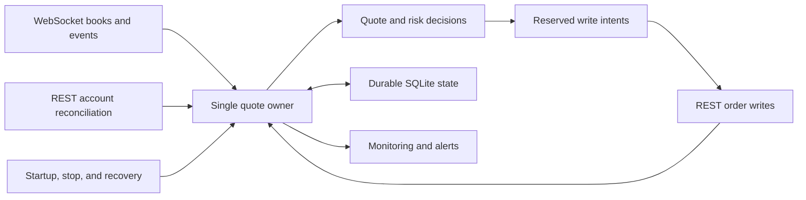

# lip

**A Go Kalshi client and a personal experiment with the Liquidity Incentive Program.**

I wanted to find out whether resting quotes could earn enough in liquidity incentives to make the inventory risk worth taking. That became two linked problems: understanding the reward rules, and building a client that keeps track of its orders and inventory when the exchange, network, or process does something awkward.

I've been using AI coding tools to research, write, test, and review this project. This repository includes the code, working notes, tests, and records of small live runs. It is work in progress. There is a working Go runtime, but I have not established a profitable strategy or qualified it for unattended trading.

## What it does

The current harness places post-only YES and NO bids at the touch in selected incentivized markets. A fill can leave a directional position. The harness then stops adding on the affected market and keeps a maker quote to reduce that position, capped by the inventory it actually holds. It also reconciles orders, fills, positions, and available funds against REST reads rather than assuming its last local state is the exchange's state.

The basic idea is simple; the difficult part is deciding what an uncertain result means. A timed-out order request may have reached the exchange. A successful cancel response may be followed by a list that still shows the order. A restarted process may inherit both inventory and unresolved writes. Those cases are a large part of the code and tests here.

Stopping new exposure is separate from stopping the observer or abandoning an exit. A planned stop can keep the process alive while it reduces inventory. That is intentional, and it can take much longer than the planned quoting window.

## Where the project stands

The latest retained candidate and live-stage reports are from **October 1, 2026**. They show different things:

| Evidence | What it supports | What it does not establish |
| --- | --- | --- |
| [Candidate-7 review](notes/first-fill-evidence-2026-09-28/candidate-7/candidate-review.md) | Passing module tests, race checks, candidate gate, and 118 mutation outcomes as expected: 117 caught and one deliberately inert control | Live coverage of every tested path |
| [Candidate-7 attended stage](notes/first-fill-evidence-2026-09-28/operator-stages/r2-KXEPLRELEGATION-27-MCI-20261001T031001.344628Z/evidence/stage-report.md) | One completed round trip, a planned drain while holding inventory, a clean process exit, and a final flat account read | The three-round-trip target, a crash with held inventory, or the wanted-side reducer re-sweep in live conditions |
| [Economics review](notes/lip-yca-review-evidence-2026-10-01/review.md) | A dated comparison of actual records and models under the July 30 terms | A positive expected return or profitable continuous operation |

The live stage took 7 hours 39 minutes. The position waited more than seven hours to finish reducing, including an exchange halt. The planned stop was followed by almost five hours of drain. There were also documented observer gaps of 18 and 96 minutes; store records and separate reads helped bracket them. These are useful results, but they are not evidence of reliable unattended operation.

Repeated-cycle qualification, unattended operation, and the continuous turnover qualification called CR-2 in the notes remain unfinished. Known issues include:

- **lip-8tl:** an order filled before its first orders walk can remain counted as pending and suppress further quoting until the touch moves.
- **lip-006:** `accountcheck` does not give a complete report when the account holds a position. An empty positions list in an incomplete report does not mean flat.
- **lip-6dn:** the WebSocket data-frame timeout causes reconnect churn during a scheduled exchange halt, even though the resting reducer remains on the exchange.

These reports are historical evidence, not fresh tests of public HEAD. Publication redaction, author-identity changes, and this README changed repository fingerprints and commit hashes. The Go source was not changed by those publication edits. Some reports refer to original local paths or ignored gate receipts that are not included here; the retained reviews describe their results and limits.

## Three layers of code

The repository grew in stages. They are worth keeping separate when reading it.

| Layer | Main paths | Purpose |
| --- | --- | --- |
| Python research and legacy probe | `rig.py`, `replay.py`, `score.py`, `analyse.py`, `probe.py`, `probebot.py`, `scripts/` | Collect books and trades, study scoring and fills, model rewards, and run early experiments. The legacy probe can place and cancel orders. |
| Frozen Go parity port | [`go/core`](go/core), [`go/feed`](go/feed), [`go/store`](go/store), [`go/tape`](go/tape), [`go/cmd/rig`](go/cmd/rig), [`go/cmd/replay`](go/cmd/replay) | Reproduce the Python collector and replay behaviour, including its numeric quirks, so the outputs can be compared. |
| Current Go trading harness | [`go/cmd/harness`](go/cmd/harness), [`go/harness`](go/harness) | Run the quote owner, transport, reconciliation, durable state, risk checks, reduction, lifecycle, and turnover logic. |

The frozen core deliberately keeps Python-compatible floating-point and rounding behaviour. The current harness has a separate [`num`](go/harness/num) package for fixed-point prices, quantities, and money. Do not read the older parsing rules as the current order path's numeric model.

The authentication signer in `go/feed` is shared, but the legacy collector's socket code is not the current harness transport. The current transport lives in `go/harness/wsx` and `go/harness/rest`.

## How the current harness fits together



[`cmd/harness`](go/cmd/harness) connects the components. One owner serializes changes to its trading state; network work returns results to that owner rather than mutating the model from each worker. The smaller packages have more focused jobs:

- [`quote`](go/harness/quote) derives quote decisions; [`risk`](go/harness/risk) accounts for exposure and reservations.
- [`rest`](go/harness/rest) handles REST reads and writes, including paginated truth reads and cancel verification; [`wsx`](go/harness/wsx) handles the live feed and its validity.
- [`hstore`](go/harness/hstore) stores orders, fills, positions, reservations, state changes, and anomalies so a restart has something concrete to reconcile.
- [`lifecycle`](go/harness/lifecycle) handles startup, ownership, persistent stops, and drain; [`ping`](go/harness/ping) handles alerts, heartbeats, and external dead-man check-ins; [`turnover`](go/harness/turnover) plans market admission and capital use and keeps restart state.

Reservations are persisted before writes. An ambiguous create keeps its potential exposure reserved until it is resolved. Merely failing to find an order in a later list is not enough to declare an uncertain create harmless. Cancel acknowledgement is also separate from confirmed absence, and incomplete reads cannot discharge that obligation.

When adds are stopped, observation and reduction continue where the available truth permits them. Unknown risk can still block placements, including a replacement reducer: the client cannot safely pretend the old order is gone and put another one beside it. The candidate-7 repair concerns re-sweeping an unverified cancel on a side the quote state still wants. Its tests exercise that path; the later live stage did not exercise that particular branch.

The detailed contract is in [harness-spec.md](notes/harness-spec.md). It is useful for behaviour and invariants, but its older economic assumptions need to be read alongside the later review.

## Build and test without an account

The Go module declares **Go 1.26.4**. Use a compatible toolchain. From the repository root:

```sh
cd go
go mod download
go build ./...
go test -count=1 -timeout=5m -p 2 ./...
```

The dependency download needs network access. Building and running these package tests does not require Kalshi credentials. Once the dependencies and toolchain are installed, the following makes the build and test commands explicitly offline:

```sh
export GOPROXY=off GOSUMDB=off GOTOOLCHAIN=local GOENV=off GOWORK=off
go build ./...
go test -count=1 -timeout=5m -p 2 ./...
```

An optional race run is `go test -race -count=1 -timeout=10m -p 2 ./...`; it needs CGO and a working C compiler. These are instructions for a new checkout, not a claim that these checks were rerun while writing this README.

Historical gate scripts such as `loop/gates.sh` contain machine-specific Mac Python and Go paths. They need adaptation before use elsewhere. The Python research code has no portable requirements file, and the root `select.py` can shadow Python's standard-library `select` module.

## Which commands talk to the outside world?

| Command or tool | Behaviour |
| --- | --- |
| `cmd/replay` | Offline replay of user-supplied recorded tapes; can write a local SQLite output. No complete raw tape is bundled for a ready-made replay run. |
| `cmd/incentives` | Public network reads of incentive programs and series metadata. |
| `cmd/rig` | Authenticated live collection; writes a database and, by default, raw tapes. |
| `cmd/conform` | Authenticated REST checks by default; `-rest=false` selects offline inspection. |
| `cmd/accountcheck` | Authenticated account reads; writes a report. Has the held-position limitation noted above. |
| `cmd/harness`, legacy Python probe | Write-capable trading clients. |
| `cmd/alarmcheck` | External notification checks. |

For an existing tape, replay accepts positional tape paths after options such as `--out`, `--universe`, `--bench`, and `--latency`. Target sizes must come from the tape header or a supplied universe file for meaningful qualifying-depth results. Offline replay does not populate the live collector's forward-mid measurements.

The live harness has separate configuration, provisioning, and operating checks. Start with the [pilot plan](notes/pilot-plan.md) and [operations runbook](notes/cr1-operations-runbook.md) if studying those paths. A passing local test or an old receipt is not a live launch instruction. The historical loop conductor is retired and disabled.

## Configuration and credentials

[config.example.json](config.example.json) and its [field guide](config.example.md) show the config shape. They contain paths from my original Mac checkout, so they are examples rather than a ready-to-run setup. The config names a market, a size and operating rung, inventory and capital limits, and the paths for the database, lock, stop latch, and credentials. The harness refuses to invent a default config or silently replace a missing operational database.

Exchange writes require both the explicit `-live` flag and a separate `live_ok` sentinel. A read-only qualification still contacts the real exchange; it is not a simulator. The current transport is tied to the production hosts, and a demo/paper environment is one of the gaps identified in the portability review.

RSA keys and API key IDs are loaded from files outside the repository. Alerting has credentials too: an ntfy topic permits reading and sending alerts, and a dead-man URL permits check-ins. Those belong outside Git even when the trading records themselves are being shared. None is needed for the offline build and test steps above.

## Economics and further reading

Early scoring work uses the February program terms. The [October 1 review](notes/lip-yca-review-evidence-2026-10-01/review.md), based on the July 30 terms, supersedes those assumptions: the reference depth, eligible-time scaling, competition for share, and $1 payout floor materially change the result. Short attended stages can earn no reward even if the orders qualify. A successful maker round trip alone does not prove the incentive strategy works.

My current conclusion is that profitability is unestablished. The review's dated verdict is stronger: not profitable as operated, and not shown profitable as designed. The next useful evidence would need to connect actual uptime, reward share, fill quality, and inventory exits over a meaningful period.

For a deeper read:

- [Port specification](notes/port-spec.md): why the collector port preserves old behaviour.
- [Verification workflow](notes/verification-workflow.md) and [negative-control catalogue](notes/harness-negative-control.md): how tests and mutations are used, and what their results mean.
- [Candidate-7 review](notes/first-fill-evidence-2026-09-28/candidate-7/candidate-review.md): a concrete cancel-reconciliation repair and its test coverage.
- [Client portability review](notes/client-portability-evidence-2026-10-01/review.md): transport measurements and limits outside the original LIP use case.

The public history retains live-run records rather than just presenting cleaned-up code. The notification topic credential was redacted for publication. The records are included to make the claims above inspectable, including the parts that did not work.
